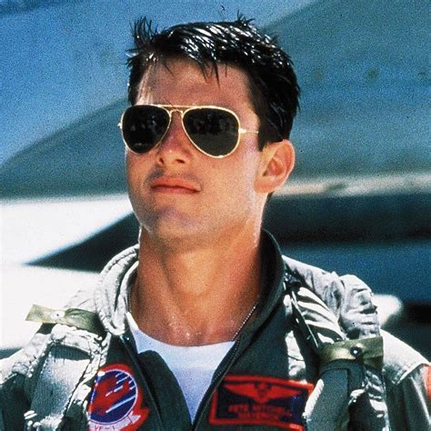

# Estudo de YOLOv8

Esse documento está sendo escrito com o intuito de documentar meu estudo da ferramenta YOLOv8 de visão computacional + machine learning.

## Vídeo de referência
``https://www.youtube.com/watch?v=m9fH9OWn8YM``
Link 1 - Vídeo de criação de um modelo de detecção de Alpacas, utilizando YOLOv8

``https://github.com/computervisioneng/train-yolov8-custom-dataset-step-by-step-guide``
Link 2 - Repositório base do criador do vídeo do Link 1

``https://www.kaggle.com/datasets/constantinwerner/human-detection-dataset``
Link 3 - Link do dataset utilizado

``https://www.cvat.ai/``
Link 4 - Link da ferramenta de Image Annotation que será utilizada no desenvolvimento deste sofware

## Propósito deste software
Criar um software que seja capaz de realizar o mesmo processo detalhado no vídeo, entretanto, voltado para a identificação de faces. Assim, acredita-se que o autor deste repositório possa aprender mais sobre a utilização desta ferramenta para posterior uso.

## Ferramentas que serão utilizadas
- Open Images Dataset v7, para a criação de um dataset com a localização de faces em diferentes imagens
- Plataforma CVAT, para a anotação de imagens

## Fases de implementação
- Fase 1: Criação de dataset
- Fase 2: Segregação entre dados de treino e de teste
- Fase 3: Geração de gráficos contendo informações sobre a assertividade do modelo
- Fase 4: Aplicação do modelo em casos reais